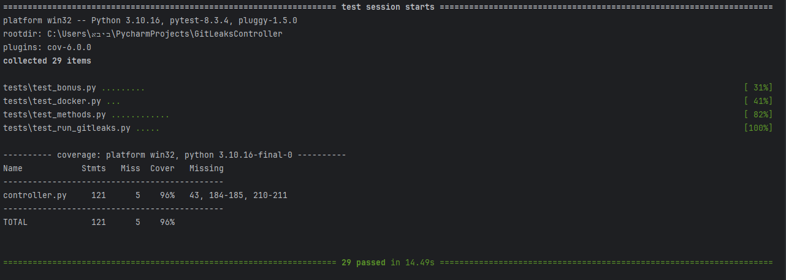

# Tests for GitLeaksController

## Overview

This directory houses the test suite for the GitLeaksController project, designed to verify the tool's functionality under various scenarios, including:

- **Successful Gitleaks Scans**: Ensures accurate results are produced for valid inputs.
- **Error Handling**: Validates responses to missing dependencies, invalid inputs, and other edge cases.
- **Docker Integration**: Confirms proper interaction with Docker for containerized scans.
- **Unit Tests**: Achieves high coverage:
  - `controller.py`: 96%
  - `bonus.py`: 100%

## Test Files

Each file in this directory focuses on specific aspects of the project:

- **`test_bonus.py`**: 
  - Test the behavior of the bonus section.
  - Focuses on features like `pydantic` and `log_error`.

- **`test_docker.py`**: 
  - Validates Docker setup and integration.
  - Includes edge cases such as:
    - Docker is not installed on the system.
    - Failed Docker image builds.

- **`test_run_gitleaks.py`**: 
  - Tests the `run_gitleaks()` method and its behavior.
  - Covers edge cases like:
    - Gitleaks not found on the system.
    - Errors during execution.

- **`test_methods.py`**: 
  - Tests the general functionality of core methods:
    - `execute_command`
    - `get_parser`
    - `main`
    - `clean_outputfile`
    - `get_findings_from_output_file`
    - `parse_json_output`

